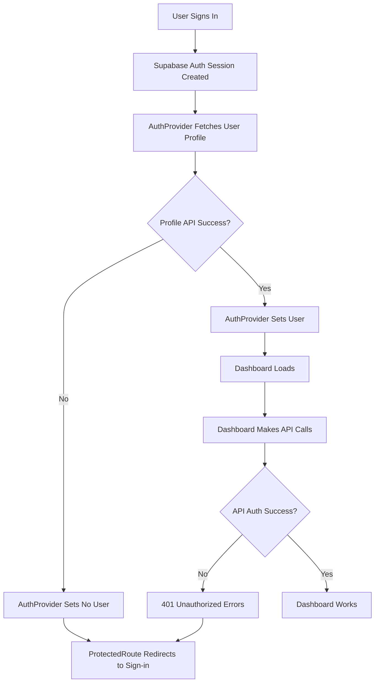
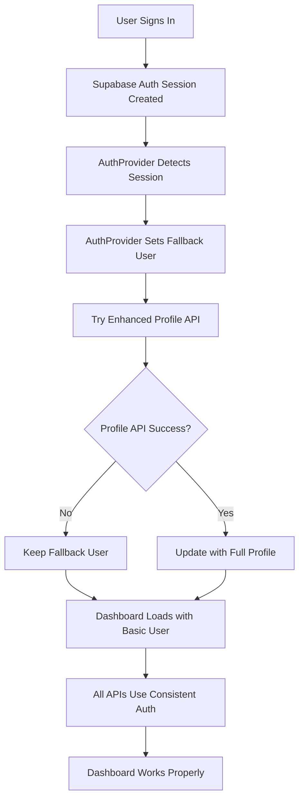

# Authentication Fix Design Document

## Overview

The authentication system needs comprehensive fixes to address persistent 401 Unauthorized errors and session management issues. The design focuses on creating a robust, consistent authentication flow that properly maintains user sessions across the entire application.

## Architecture

### Current Issues Analysis



### Target Architecture



## Components and Interfaces

### 1. Enhanced AuthProvider

**Purpose**: Provide robust authentication state management with fallback mechanisms

**Key Features**:
- Immediate fallback user data from Supabase session
- Graceful handling of profile API failures
- Consistent user state across all components
- Proper session lifecycle management

**Implementation**:

```typescript
interface AuthState {
  user: User | null
  loading: boolean
  error: string | null
  sessionChecked: boolean
}

interface User {
  id: string
  email: string
  name: string
  plan: string
  avatar_url?: string
}

class AuthProvider {
  // Immediate session detection
  detectSession(): Promise<User | null>
  
  // Fallback user creation
  createFallbackUser(supabaseUser: SupabaseUser): User
  
  // Enhanced profile fetching with retry
  fetchEnhancedProfile(userId: string): Promise<User | null>
  
  // Session refresh handling
  handleSessionRefresh(): void
  
  // Error recovery
  recoverFromAuthError(): void
}
```

### 2. Consistent API Authentication

**Purpose**: Ensure all API endpoints use the same authentication mechanism

**Standardized Auth Check**:

```typescript
// Standard auth middleware for all API routes
async function authenticateRequest(request: NextRequest) {
  const supabase = createServerSupabaseClient()
  const { data: { user }, error } = await supabase.auth.getUser()
  
  if (error || !user) {
    return { error: 'Unauthorized', status: 401 }
  }
  
  return { user, error: null }
}

// Usage in all API routes
export async function GET(request: NextRequest) {
  const auth = await authenticateRequest(request)
  if (auth.error) {
    return NextResponse.json({ error: auth.error }, { status: auth.status })
  }
  
  // Continue with authenticated user
  const user = auth.user
  // ... rest of API logic
}
```

### 3. Improved Dashboard Layout

**Purpose**: Handle authentication state and API responses properly

**Key Improvements**:
- Use AuthProvider exclusively for user data
- Proper error handling for API responses
- Fallback content for failed API calls
- Loading states for better UX

**Implementation**:

```typescript
function DashboardLayout({ children }: { children: React.ReactNode }) {
  const { user, loading, signOut } = useAuth()
  const [notifications, setNotifications] = useState<Notification[]>([])
  const [stats, setStats] = useState<DashboardStats | null>(null)
  const [apiErrors, setApiErrors] = useState<string[]>([])

  // Fetch data with proper error handling
  const fetchWithErrorHandling = async (url: string, setter: Function) => {
    try {
      const response = await fetch(url)
      if (response.ok) {
        const result = await response.json()
        setter(result.success ? result.data : result)
      } else if (response.status === 401) {
        // Handle auth errors by signing out
        await signOut()
      } else {
        setApiErrors(prev => [...prev, `Failed to load ${url}`])
      }
    } catch (error) {
      setApiErrors(prev => [...prev, `Network error loading ${url}`])
    }
  }

  // Load dashboard data
  useEffect(() => {
    if (user && !loading) {
      fetchWithErrorHandling('/api/notifications', setNotifications)
      fetchWithErrorHandling('/api/dashboard/stats', setStats)
    }
  }, [user, loading])

  // ... rest of component
}
```

### 4. Enhanced Middleware

**Purpose**: Provide consistent route protection with proper error handling

**Implementation**:

```typescript
export async function middleware(request: NextRequest) {
  try {
    const response = NextResponse.next()
    const supabase = createMiddlewareSupabaseClient(request, response)

    // Get session with timeout
    const sessionPromise = supabase.auth.getSession()
    const timeoutPromise = new Promise((_, reject) => 
      setTimeout(() => reject(new Error('Session check timeout')), 5000)
    )

    const { data: { session } } = await Promise.race([
      sessionPromise,
      timeoutPromise
    ]) as any

    const isProtectedPath = protectedPaths.some(path => 
      request.nextUrl.pathname.startsWith(path)
    )
    const isAuthPath = authPaths.includes(request.nextUrl.pathname)

    if (isProtectedPath && !session) {
      const redirectUrl = new URL('/auth/signin', request.url)
      redirectUrl.searchParams.set('redirectTo', request.nextUrl.pathname)
      redirectUrl.searchParams.set('reason', 'session_expired')
      return NextResponse.redirect(redirectUrl)
    }

    if (isAuthPath && session) {
      return NextResponse.redirect(new URL('/dashboard', request.url))
    }

    return response
  } catch (error) {
    console.error('Middleware error:', error)
    // On middleware errors, allow the request to proceed
    // The individual route handlers will handle auth
    return NextResponse.next()
  }
}
```

## Data Flow

### Authentication Flow

1. **Initial Load**:
   - AuthProvider checks for existing Supabase session
   - If session exists, immediately create fallback user
   - Attempt to fetch enhanced profile in background
   - Set user state regardless of profile API success

2. **API Requests**:
   - All API routes use standardized auth check
   - Consistent error responses for auth failures
   - Proper session validation using server Supabase client

3. **Dashboard Loading**:
   - Dashboard uses user from AuthProvider
   - API calls include proper error handling
   - 401 errors trigger sign-out flow
   - Non-auth errors show user-friendly messages

4. **Session Management**:
   - Supabase handles session refresh automatically
   - AuthProvider listens for auth state changes
   - Middleware protects routes consistently
   - Sign-out clears all session data

## Error Handling Strategy

### API Error Categories

1. **Authentication Errors (401)**:
   - Trigger automatic sign-out
   - Redirect to sign-in page
   - Clear all cached data

2. **Authorization Errors (403)**:
   - Show access denied message
   - Don't sign out user
   - Log for debugging

3. **Network Errors**:
   - Show retry options
   - Maintain user session
   - Provide offline indicators

4. **Server Errors (500)**:
   - Show generic error message
   - Maintain user session
   - Log for debugging

### Recovery Mechanisms

```typescript
// Auth error recovery
const handleAuthError = async (error: AuthError) => {
  if (error.status === 401) {
    await signOut()
    router.push('/auth/signin?reason=session_expired')
  } else {
    setError('Authentication error occurred. Please try again.')
  }
}

// Network error recovery
const handleNetworkError = (error: NetworkError) => {
  setError('Network error. Please check your connection.')
  // Implement retry logic
  setTimeout(() => retryLastRequest(), 5000)
}

// API error recovery
const handleApiError = (error: ApiError) => {
  switch (error.status) {
    case 401:
      return handleAuthError(error)
    case 403:
      return setError('Access denied')
    case 500:
      return setError('Server error. Please try again later.')
    default:
      return setError('An error occurred. Please try again.')
  }
}
```

## Security Considerations

### Session Security
- Use secure HTTP-only cookies for session storage
- Implement proper CSRF protection
- Set appropriate session timeouts
- Validate sessions on every API request

### Error Information
- Don't expose sensitive auth details in error messages
- Log detailed errors server-side only
- Provide generic user-facing error messages
- Implement rate limiting for auth endpoints

### Route Protection
- Validate authentication on both client and server
- Use middleware for consistent route protection
- Implement proper redirect handling
- Prevent auth bypass attempts

## Performance Optimization

### Caching Strategy
- Cache user profile data with appropriate TTL
- Use React Query for API state management
- Implement optimistic updates where appropriate
- Minimize unnecessary auth checks

### Loading States
- Show immediate loading indicators
- Implement skeleton screens for better UX
- Use progressive loading for dashboard data
- Provide offline capabilities where possible

## Testing Strategy

### Authentication Tests
- Test session creation and validation
- Test auth error handling
- Test middleware route protection
- Test sign-out flow

### API Integration Tests
- Test all API endpoints with valid sessions
- Test API responses to invalid sessions
- Test error handling for various scenarios
- Test concurrent request handling

### User Experience Tests
- Test navigation between protected routes
- Test page refresh behavior
- Test network error scenarios
- Test session expiration handling