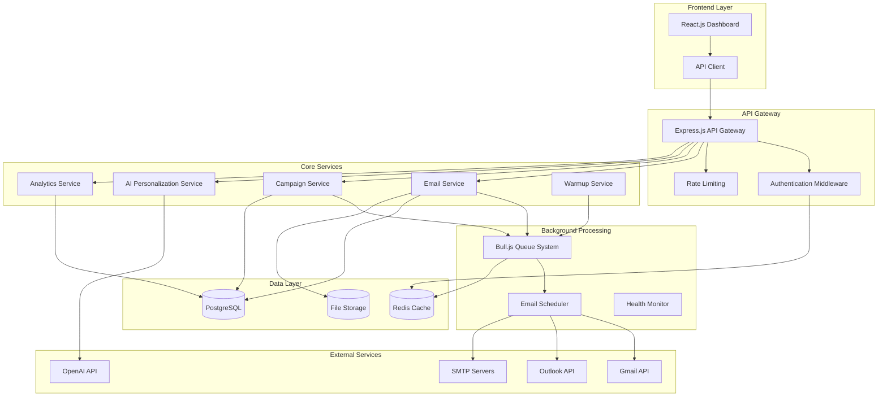

# Design Document

## Overview

ColdReach Pro is a comprehensive email outreach automation platform built with a modern, scalable architecture. The system leverages AI for personalization, implements sophisticated scheduling algorithms, and provides robust deliverability protection. The design follows a microservices-inspired modular approach with clear separation of concerns between email management, campaign execution, AI processing, and analytics.

## Architecture

### High-Level Architecture



### Technology Stack

**Frontend:**
- React.js 18 with TypeScript for type safety
- Next.js 14 for SSR, routing, and API routes
- Tailwind CSS for responsive styling
- React Query for state management and caching
- Chart.js for analytics visualization
- React Hook Form for form management

**Backend:**
- Node.js 20 with Express.js framework
- TypeScript for full-stack type safety
- PostgreSQL 15 for primary data storage
- Redis 7 for caching and session management
- Bull.js for background job processing
- Nodemailer for email sending
- Passport.js for authentication

**Infrastructure:**
- Docker containers for consistent deployment
- Railway for hosting and deployment
- AWS S3 for file storage (CSV uploads, exports)
- Upstash Redis for managed Redis hosting
- SendGrid for transactional emails

## Components and Interfaces

### 1. Email Account Management Component

**Purpose:** Handles connection, authentication, and management of multiple email accounts across different providers.

**Key Interfaces:**

```typescript
interface EmailAccount {
  id: string;
  userId: string;
  email: string;
  provider: 'gmail' | 'outlook' | 'smtp';
  connectionType: 'oauth' | 'smtp';
  displayName: string;
  isActive: boolean;
  warmupStatus: 'pending' | 'in_progress' | 'completed';
  dailyLimit: number;
  connectionStatus: 'connected' | 'failed' | 'testing';
  lastTestedAt: Date;
  smtpConfig?: SMTPConfig;
  oauthTokens?: OAuthTokens;
}

interface SMTPConfig {
  smtpHost: string;
  smtpPort: number;
  smtpSecurity: 'STARTTLS' | 'SSL' | 'NONE';
  smtpUsername: string;
  smtpPassword: string; // encrypted
  imapHost: string;
  imapPort: number;
  imapSecurity: 'SSL' | 'STARTTLS';
}

interface OAuthTokens {
  accessToken: string;
  refreshToken: string;
  expiresAt: Date;
}
```

**Core Functions:**
- OAuth flow management for Gmail/Outlook
- SMTP configuration validation and testing
- Token refresh and management
- Connection health monitoring
- Domain authentication verification (SPF, DKIM, DMARC)

### 2. Contact Management Component

**Purpose:** Manages contact data, validation, segmentation, and list operations.

**Key Interfaces:**

```typescript
interface Contact {
  id: string;
  userId: string;
  email: string;
  firstName: string;
  lastName: string;
  companyName?: string;
  jobTitle?: string;
  website?: string;
  industry?: string;
  customFields: Record<string, any>;
  tags: string[];
  status: 'active' | 'bounced' | 'unsubscribed' | 'invalid';
  validationStatus: 'pending' | 'valid' | 'invalid' | 'risky';
  createdAt: Date;
  updatedAt: Date;
}

interface ContactList {
  id: string;
  name: string;
  contacts: Contact[];
  totalCount: number;
  validCount: number;
  tags: string[];
}
```

**Core Functions:**
- CSV parsing and field mapping
- Email validation using external APIs
- Duplicate detection and merging
- Segmentation and tagging
- Bulk operations (import/export)
- Contact enrichment

### 3. AI Personalization Engine

**Purpose:** Generates personalized email content using AI models with customizable prompts and templates.

**Key Interfaces:**

```typescript
interface AIPersonalizationRequest {
  contactData: Contact;
  template: AITemplate;
  customPrompt?: string;
  variables: Record<string, string>;
}

interface AITemplate {
  id: string;
  name: string;
  prompt: string;
  industry?: string;
  useCase: string;
  variables: string[];
}

interface PersonalizationResult {
  contactId: string;
  personalizedContent: string;
  confidence: number;
  variablesUsed: string[];
  processingTime: number;
}
```

**Core Functions:**
- Integration with OpenAI GPT-4/3.5 and Anthropic Claude
- Template management and customization
- Variable replacement system
- Batch processing for bulk personalization
- Content quality scoring
- Fallback handling for API failures

### 4. Campaign Management System

**Purpose:** Orchestrates email sequences, scheduling, and campaign execution with conditional logic.

**Key Interfaces:**

```typescript
interface Campaign {
  id: string;
  userId: string;
  name: string;
  status: 'draft' | 'active' | 'paused' | 'completed';
  contactListId: string;
  emailSequence: EmailStep[];
  aiSettings: AIPersonalizationSettings;
  scheduleSettings: ScheduleSettings;
  createdAt: Date;
  launchedAt?: Date;
}

interface EmailStep {
  stepNumber: number;
  subject: string;
  content: string;
  delayDays: number;
  conditions: StepCondition[];
  abTestVariant?: string;
}

interface StepCondition {
  type: 'reply_received' | 'email_opened' | 'link_clicked' | 'time_elapsed';
  action: 'stop_sequence' | 'skip_step' | 'branch_to_step';
  value?: any;
}
```

**Core Functions:**
- Visual sequence builder logic
- Conditional branching and logic evaluation
- A/B testing management
- Campaign state management
- Progress tracking and reporting

### 5. Smart Scheduling Engine

**Purpose:** Optimizes email sending times, manages rate limits, and ensures deliverability compliance.

**Key Interfaces:**

```typescript
interface ScheduleSettings {
  timeZoneDetection: boolean;
  businessHoursOnly: boolean;
  customTimeWindows: TimeWindow[];
  avoidWeekends: boolean;
  avoidHolidays: boolean;
  rateLimiting: RateLimitSettings;
}

interface RateLimitSettings {
  dailyLimit: number;
  domainLimit: number;
  accountRotation: boolean;
  warmupMode: boolean;
}

interface EmailScheduleJob {
  id: string;
  campaignId: string;
  contactId: string;
  emailAccountId: string;
  stepNumber: number;
  scheduledAt: Date;
  status: 'pending' | 'sent' | 'failed' | 'cancelled';
  priority: number;
}
```

**Core Functions:**
- Time zone detection and optimization
- Rate limiting enforcement
- Account rotation logic
- Queue management and prioritization
- Retry mechanisms for failed sends

### 6. Email Warmup System

**Purpose:** Automatically warms up new email accounts to improve deliverability and sender reputation.

**Key Interfaces:**

```typescript
interface WarmupPlan {
  emailAccountId: string;
  currentWeek: number;
  dailyTarget: number;
  actualSent: number;
  strategy: 'conservative' | 'moderate' | 'aggressive';
  status: 'active' | 'paused' | 'completed';
  metrics: WarmupMetrics;
}

interface WarmupMetrics {
  deliveryRate: number;
  openRate: number;
  replyRate: number;
  spamComplaints: number;
  bounceRate: number;
}
```

**Core Functions:**
- Progressive volume increase scheduling
- Warmup email generation and sending
- Reputation monitoring and adjustment
- Strategy optimization based on performance
- Integration with campaign scheduling

### 7. Analytics and Tracking System

**Purpose:** Provides comprehensive tracking, reporting, and performance analytics for campaigns and accounts.

**Key Interfaces:**

```typescript
interface EmailTracking {
  id: string;
  campaignId: string;
  contactId: string;
  emailAccountId: string;
  stepNumber: number;
  status: 'sent' | 'delivered' | 'opened' | 'clicked' | 'replied' | 'bounced';
  sentAt: Date;
  deliveredAt?: Date;
  openedAt?: Date;
  clickedAt?: Date;
  repliedAt?: Date;
  bounceReason?: string;
  trackingPixelId: string;
  linkClicks: LinkClick[];
}

interface CampaignAnalytics {
  campaignId: string;
  totalSent: number;
  deliveryRate: number;
  openRate: number;
  clickRate: number;
  replyRate: number;
  positiveReplyRate: number;
  unsubscribeRate: number;
  bounceRate: number;
  performanceByStep: StepPerformance[];
}
```

**Core Functions:**
- Real-time event tracking
- Performance metric calculation
- Report generation and export
- A/B test analysis
- Deliverability monitoring

## Data Models

### Database Schema Design

**Users Table:**
```sql
CREATE TABLE users (
  id SERIAL PRIMARY KEY,
  email VARCHAR(255) UNIQUE NOT NULL,
  name VARCHAR(255) NOT NULL,
  plan VARCHAR(50) DEFAULT 'starter',
  subscription_status VARCHAR(50) DEFAULT 'active',
  created_at TIMESTAMP DEFAULT NOW(),
  updated_at TIMESTAMP DEFAULT NOW()
);
```

**Email Accounts Table:**
```sql
CREATE TABLE email_accounts (
  id SERIAL PRIMARY KEY,
  user_id INTEGER REFERENCES users(id) ON DELETE CASCADE,
  email VARCHAR(255) NOT NULL,
  provider VARCHAR(50) NOT NULL,
  connection_type VARCHAR(20) NOT NULL,
  display_name VARCHAR(255),
  is_active BOOLEAN DEFAULT true,
  warmup_status VARCHAR(50) DEFAULT 'pending',
  daily_limit INTEGER DEFAULT 30,
  connection_status VARCHAR(50) DEFAULT 'pending',
  smtp_config JSONB,
  oauth_tokens JSONB,
  last_tested_at TIMESTAMP,
  created_at TIMESTAMP DEFAULT NOW()
);
```

**Contacts Table:**
```sql
CREATE TABLE contacts (
  id SERIAL PRIMARY KEY,
  user_id INTEGER REFERENCES users(id) ON DELETE CASCADE,
  email VARCHAR(255) NOT NULL,
  first_name VARCHAR(255),
  last_name VARCHAR(255),
  company_name VARCHAR(255),
  job_title VARCHAR(255),
  website VARCHAR(255),
  industry VARCHAR(255),
  custom_fields JSONB DEFAULT '{}',
  tags TEXT[] DEFAULT '{}',
  status VARCHAR(50) DEFAULT 'active',
  validation_status VARCHAR(50) DEFAULT 'pending',
  created_at TIMESTAMP DEFAULT NOW(),
  updated_at TIMESTAMP DEFAULT NOW(),
  UNIQUE(user_id, email)
);
```

**Campaigns Table:**
```sql
CREATE TABLE campaigns (
  id SERIAL PRIMARY KEY,
  user_id INTEGER REFERENCES users(id) ON DELETE CASCADE,
  name VARCHAR(255) NOT NULL,
  status VARCHAR(50) DEFAULT 'draft',
  contact_list_ids INTEGER[] DEFAULT '{}',
  email_sequence JSONB NOT NULL,
  ai_settings JSONB DEFAULT '{}',
  schedule_settings JSONB DEFAULT '{}',
  created_at TIMESTAMP DEFAULT NOW(),
  launched_at TIMESTAMP,
  completed_at TIMESTAMP
);
```

**Email Tracking Table:**
```sql
CREATE TABLE email_tracking (
  id SERIAL PRIMARY KEY,
  campaign_id INTEGER REFERENCES campaigns(id) ON DELETE CASCADE,
  contact_id INTEGER REFERENCES contacts(id) ON DELETE CASCADE,
  email_account_id INTEGER REFERENCES email_accounts(id),
  step_number INTEGER NOT NULL,
  status VARCHAR(50) DEFAULT 'pending',
  sent_at TIMESTAMP,
  delivered_at TIMESTAMP,
  opened_at TIMESTAMP,
  clicked_at TIMESTAMP,
  replied_at TIMESTAMP,
  bounce_reason TEXT,
  tracking_data JSONB DEFAULT '{}',
  created_at TIMESTAMP DEFAULT NOW()
);
```

## Error Handling

### Error Classification System

**1. Authentication Errors:**
- OAuth token expiration and refresh failures
- SMTP authentication failures
- Invalid credentials handling
- Rate limiting from email providers

**2. Email Delivery Errors:**
- SMTP connection failures
- Recipient address validation errors
- Content-based rejections (spam filters)
- Rate limit exceeded errors

**3. Data Processing Errors:**
- CSV parsing and validation errors
- AI API failures and timeouts
- Database connection issues
- File upload and storage errors

**4. Campaign Execution Errors:**
- Scheduling conflicts and failures
- Sequence logic errors
- Contact list processing errors
- Warmup process interruptions

### Error Handling Strategies

**Retry Mechanisms:**
```typescript
interface RetryConfig {
  maxAttempts: number;
  backoffStrategy: 'exponential' | 'linear' | 'fixed';
  baseDelay: number;
  maxDelay: number;
  retryableErrors: string[];
}

const emailSendRetryConfig: RetryConfig = {
  maxAttempts: 3,
  backoffStrategy: 'exponential',
  baseDelay: 1000,
  maxDelay: 30000,
  retryableErrors: ['TIMEOUT', 'CONNECTION_ERROR', 'RATE_LIMIT']
};
```

**Graceful Degradation:**
- AI personalization fallback to templates
- Alternative email account rotation
- Reduced sending rates during issues
- Manual intervention alerts for critical failures

**Error Monitoring and Alerting:**
- Real-time error tracking and logging
- User notifications for account issues
- Admin alerts for system-wide problems
- Performance degradation detection

## Testing Strategy

### Unit Testing
- **Coverage Target:** 80% minimum code coverage
- **Framework:** Jest with TypeScript support
- **Focus Areas:**
  - Email validation and parsing logic
  - AI personalization algorithms
  - Scheduling and rate limiting logic
  - Authentication and security functions

### Integration Testing
- **Email Provider Integration:** Mock and real API testing
- **Database Operations:** Transaction testing and rollback scenarios
- **Queue Processing:** Job execution and failure handling
- **External API Integration:** AI services and email validation APIs

### End-to-End Testing
- **User Workflows:** Complete campaign creation and execution
- **Email Delivery:** Full send-to-inbox testing with test accounts
- **Analytics Tracking:** Event tracking and reporting accuracy
- **Multi-account Scenarios:** Account rotation and load distribution

### Performance Testing
- **Load Testing:** Concurrent user and campaign handling
- **Bulk Operations:** Large contact list processing
- **Email Throughput:** High-volume sending capabilities
- **Database Performance:** Query optimization and indexing

### Security Testing
- **Authentication:** OAuth flow and session management
- **Data Encryption:** Sensitive data protection
- **Input Validation:** SQL injection and XSS prevention
- **Rate Limiting:** API abuse prevention

### Testing Environment Setup
```typescript
// Test Configuration
const testConfig = {
  database: {
    host: 'localhost',
    port: 5432,
    database: 'coldreach_test',
    username: 'test_user',
    password: 'test_password'
  },
  redis: {
    host: 'localhost',
    port: 6379,
    db: 1
  },
  email: {
    testMode: true,
    mockProviders: ['gmail', 'outlook'],
    testAccounts: ['test@example.com']
  },
  ai: {
    mockResponses: true,
    testPrompts: true
  }
};
```

This design provides a robust, scalable foundation for ColdReach Pro that addresses all requirements while maintaining flexibility for future enhancements. The modular architecture ensures maintainability, and the comprehensive error handling and testing strategies ensure reliability and user trust.