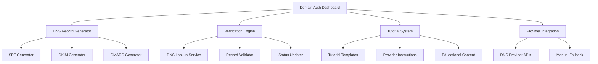

# Domain Authentication Design Document

## Overview

The Domain Authentication system provides a comprehensive solution for setting up and managing SPF, DKIM, and DMARC records for email domains. It combines educational content, automated DNS record generation, step-by-step tutorials, and ongoing verification to ensure users can properly configure their domains for optimal email deliverability.

## Architecture

### System Components



### Data Flow

1. **Domain Registration**: User adds domain or system extracts from email account
2. **Record Generation**: System creates SPF, DKIM, DMARC records with proper values
3. **Tutorial Display**: System shows provider-specific setup instructions
4. **User Configuration**: User applies DNS records through their provider
5. **Verification**: System performs DNS lookups and validates configuration
6. **Status Update**: Database updated with verification results
7. **Monitoring**: Periodic re-verification and alerting

## Components and Interfaces

### 1. Domain Authentication Dashboard (`/dashboard/domain-auth`)

**Purpose**: Central hub for managing domain authentication across all user domains

**Key Features**:
- Domain overview with verification status
- Quick access to setup tutorials
- Bulk verification actions
- Educational content integration

**Interface Elements**:
```typescript
interface DomainAuthDashboard {
  domains: DomainStatus[]
  overallHealth: 'good' | 'warning' | 'critical'
  pendingActions: ActionItem[]
  educationalTips: EducationalContent[]
}

interface DomainStatus {
  domain: string
  spfStatus: VerificationStatus
  dkimStatus: VerificationStatus
  dmarcStatus: VerificationStatus
  lastVerified: Date
  emailAccounts: string[]
  issues: Issue[]
}
```

### 2. DNS Record Generator Service

**Purpose**: Generate accurate DNS records for each authentication method

**SPF Record Generation**:
```typescript
interface SPFConfig {
  domain: string
  includeProviders: string[] // ['gmail.com', 'outlook.com']
  ipAddresses: string[]
  mechanism: 'softfail' | 'hardfail'
}

// Example output: "v=spf1 include:_spf.google.com include:spf.protection.outlook.com ~all"
```

**DKIM Record Generation**:
```typescript
interface DKIMConfig {
  domain: string
  selector: string // e.g., 'coldreach2024'
  keySize: 1024 | 2048
  publicKey: string
  privateKey: string
}

// Example output: "v=DKIM1; k=rsa; p=MIGfMA0GCSqGSIb3DQEBAQUAA4GNADCBiQKBgQC..."
```

**DMARC Record Generation**:
```typescript
interface DMARCConfig {
  domain: string
  policy: 'none' | 'quarantine' | 'reject'
  percentage: number
  reportEmail: string
  aggregateReports: boolean
  forensicReports: boolean
}

// Example output: "v=DMARC1; p=quarantine; rua=mailto:dmarc@example.com; pct=25"
```

### 3. Tutorial System

**Purpose**: Provide step-by-step instructions for DNS configuration

**Tutorial Structure**:
```typescript
interface Tutorial {
  domain: string
  provider: DNSProvider
  steps: TutorialStep[]
  estimatedTime: number
  difficulty: 'beginner' | 'intermediate' | 'advanced'
}

interface TutorialStep {
  title: string
  description: string
  screenshot?: string
  code?: string
  tips: string[]
  commonMistakes: string[]
}
```

**Supported DNS Providers**:
- GoDaddy
- Cloudflare
- Namecheap
- Google Domains
- AWS Route 53
- Generic/Other

### 4. Verification Engine

**Purpose**: Validate DNS records and update verification status

**DNS Lookup Service**:
```typescript
interface DNSLookupService {
  lookupSPF(domain: string): Promise<SPFRecord | null>
  lookupDKIM(domain: string, selector: string): Promise<DKIMRecord | null>
  lookupDMARC(domain: string): Promise<DMARCRecord | null>
  validateRecord(record: DNSRecord): ValidationResult
}

interface ValidationResult {
  isValid: boolean
  errors: string[]
  warnings: string[]
  suggestions: string[]
}
```

**Verification Workflow**:
1. Perform DNS TXT record lookups
2. Parse and validate record syntax
3. Check record values against expected configuration
4. Update database with results
5. Generate user-friendly status messages

### 5. Provider Integration System

**Purpose**: Enable automatic DNS record creation through provider APIs

**API Integration**:
```typescript
interface DNSProviderAPI {
  provider: DNSProvider
  authenticate(credentials: ProviderCredentials): Promise<boolean>
  createRecord(domain: string, record: DNSRecord): Promise<boolean>
  updateRecord(domain: string, record: DNSRecord): Promise<boolean>
  deleteRecord(domain: string, recordId: string): Promise<boolean>
}
```

**Supported Integrations**:
- Cloudflare API
- GoDaddy API
- AWS Route 53 API
- Google Cloud DNS API

## Data Models

### Database Schema

```sql
-- Domain authentication tracking
CREATE TABLE domain_auth (
  id UUID PRIMARY KEY DEFAULT uuid_generate_v4(),
  user_id UUID REFERENCES auth.users(id),
  domain TEXT NOT NULL,
  spf_verified BOOLEAN DEFAULT FALSE,
  spf_record TEXT,
  spf_last_checked TIMESTAMP WITH TIME ZONE,
  dkim_verified BOOLEAN DEFAULT FALSE,
  dkim_selector TEXT,
  dkim_public_key TEXT,
  dkim_private_key TEXT, -- Encrypted
  dkim_last_checked TIMESTAMP WITH TIME ZONE,
  dmarc_verified BOOLEAN DEFAULT FALSE,
  dmarc_record TEXT,
  dmarc_last_checked TIMESTAMP WITH TIME ZONE,
  dns_provider TEXT,
  auto_configured BOOLEAN DEFAULT FALSE,
  created_at TIMESTAMP WITH TIME ZONE DEFAULT NOW(),
  updated_at TIMESTAMP WITH TIME ZONE DEFAULT NOW()
);

-- DNS provider credentials (encrypted)
CREATE TABLE dns_provider_credentials (
  id UUID PRIMARY KEY DEFAULT uuid_generate_v4(),
  user_id UUID REFERENCES auth.users(id),
  provider TEXT NOT NULL,
  credentials JSONB, -- Encrypted API keys/tokens
  is_active BOOLEAN DEFAULT TRUE,
  created_at TIMESTAMP WITH TIME ZONE DEFAULT NOW()
);

-- Verification history for monitoring
CREATE TABLE domain_verification_history (
  id UUID PRIMARY KEY DEFAULT uuid_generate_v4(),
  domain_auth_id UUID REFERENCES domain_auth(id),
  verification_type TEXT NOT NULL, -- 'spf', 'dkim', 'dmarc'
  status BOOLEAN NOT NULL,
  error_message TEXT,
  checked_at TIMESTAMP WITH TIME ZONE DEFAULT NOW()
);
```

## Error Handling

### DNS Lookup Errors
- **Timeout**: Retry with exponential backoff
- **NXDOMAIN**: Clear error message about domain not existing
- **No TXT Records**: Guide user to add records
- **Multiple Records**: Warn about conflicts and suggest consolidation

### Validation Errors
- **Syntax Errors**: Highlight specific issues with correction suggestions
- **Policy Conflicts**: Explain conflicts and recommend resolutions
- **Missing Includes**: Suggest adding required SPF includes

### API Integration Errors
- **Authentication Failures**: Guide user through credential setup
- **Rate Limiting**: Queue requests and inform user of delays
- **Permission Errors**: Explain required DNS permissions

## Testing Strategy

### Unit Tests
- DNS record generation accuracy
- Record parsing and validation logic
- Encryption/decryption of sensitive data
- Tutorial content rendering

### Integration Tests
- DNS lookup functionality
- Provider API integrations
- Database operations
- Email notification system

### End-to-End Tests
- Complete domain setup workflow
- Verification process from start to finish
- Error handling scenarios
- Multi-domain management

### Performance Tests
- DNS lookup response times
- Bulk verification operations
- Database query optimization
- API rate limit handling

## Security Considerations

### Data Protection
- Encrypt DKIM private keys at rest
- Secure storage of DNS provider credentials
- Audit logging for all DNS operations
- Rate limiting to prevent abuse

### Access Control
- User-specific domain access only
- API key validation for provider integrations
- Secure credential storage and rotation
- Permission-based feature access

### DNS Security
- DNSSEC validation when available
- Protection against DNS spoofing
- Secure communication with DNS providers
- Validation of DNS responses

## Performance Optimization

### Caching Strategy
- Cache DNS lookup results (TTL-based)
- Cache tutorial content and screenshots
- Cache provider-specific instructions
- Cache validation results

### Async Processing
- Background DNS verification jobs
- Queued provider API calls
- Batch processing for bulk operations
- Non-blocking user interface updates

### Database Optimization
- Indexed queries for domain lookups
- Efficient storage of verification history
- Optimized joins for dashboard queries
- Archival of old verification data